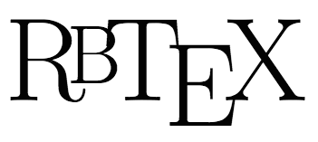

# RbTeX
Presenting...  



# About this project
I love LaTeX. Seriously, it is the most amazing piece of software to ever be created. But, despite
its Turing completeness, it's just not built for dynamic programming. Sure, there's LuaLaTeX,
but no one really uses Lua, and the Lua standard libraries are very lacking in power. This
project is dedicated to bringing the power of Ruby to LaTeX.

# Stipulations
The actually processor, `rblatex`, only works on UNIX based systems with `/usr/bin/env` and an up
to date Ruby distribution. To run it, simply create a `.tex` document with some stuff in it, and
run `rblatex mydoc.tex`. Here is a minimal working example:
```tex
\documentclass{article}
\usepackage{rubylatex}

\begin{document}
\noindent Here, have some \LaTeX\\
\begin{rbtex}
Tex.print "Here, have some #{Tex.logo}"
\end{rbtex}
\end{document}
```
If you try to compile this with `pdflatex`, it will fail spectacularly.

# Documentation
The documentation for this project is hosted at [this place](http://rubylatex.github.io/).
